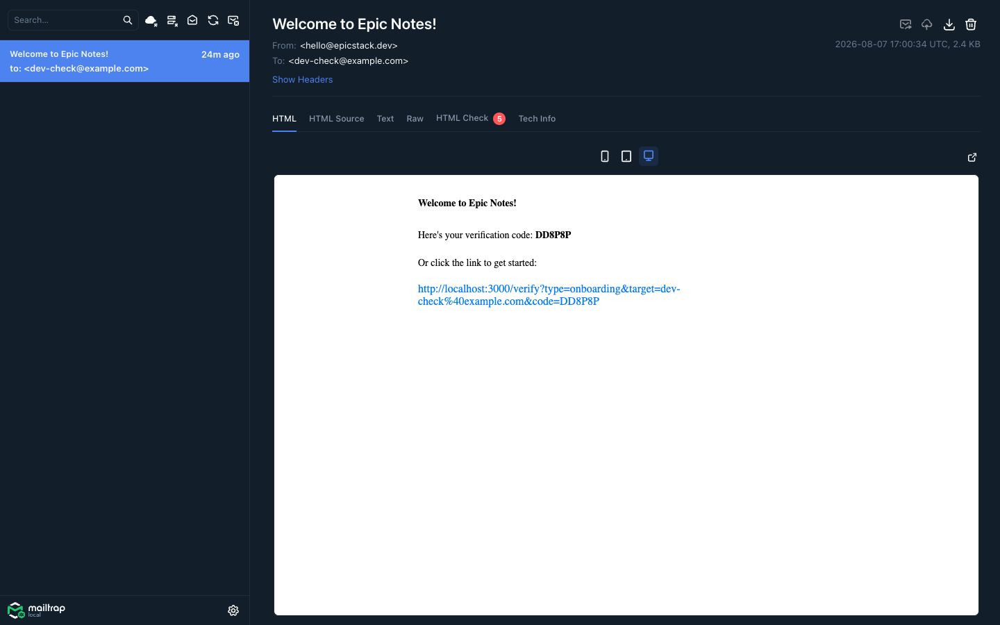

# Epic Stack + Mailtrap Local

An example of the Epic Stack sending mail through a local SMTP server in
development, so the emails the app sends can be opened and read in a browser.

## Why do this?

Out of the box the Epic Stack mocks the Resend API with
[MSW](https://mswjs.io/): the email is logged to the terminal as JSON and
written to `tests/fixtures/email/` for the e2e tests to read. That works well,
and the tests here still rely on it.

What it doesn't give you is the rendered message. The Epic Stack builds its
emails with [React Email](https://react.email/) components, and a JSON blob in
the terminal tells you nothing about how the result actually looks — so tweaking
an email template means reading HTML in a log line.

This example points the app's email at
[Mailtrap Local](https://github.com/mailtrap/mailtrap-local) instead, which
gives you:

- the rendered HTML, the plain-text part, the headers and the raw source of
  every message the app sends
- an HTML compatibility check, which flags CSS the major mail clients don't
  support — the kind of thing you'd otherwise find out after sending
- a real SMTP hop, so the sending path is exercised rather than intercepted

Mailtrap Local is MIT-licensed. It can be run via Docker, and also ships as a
single self-contained binary. It listens for SMTP on port `3535` and serves its
web UI and JSON API on port `3550`.

The stock Epic Stack signup email, caught and rendered:



## Setup

Copy the env file and install:

```sh
cp .env.example .env
npm install
npm run setup
```

Start Mailtrap Local:

```sh
docker compose up -d
```

Or, without Docker:

```sh
brew tap mailtrap/local
brew install mailtrap-local
brew services start mailtrap-local
```

Then start the app:

```sh
npm run dev
```

Sign up at http://localhost:3000/signup and the welcome email shows up at
**http://127.0.0.1:3550**. Forgot-password and change-email go to the same
place.

## What changed from the stock Epic Stack

Compare against the `init` commit to see the whole diff. In short:

- **`app/utils/email.server.ts`** — when `SMTP_HOST` is set, `sendEmail` sends
  via nodemailer and returns early. The Resend branch below it is untouched, so
  production behaviour does not change.
- **`app/utils/env.server.ts`** — `SMTP_HOST` and `SMTP_PORT` added to the zod
  schema, both optional.
- **`.env.example`** — sets `SMTP_HOST` / `SMTP_PORT`. Comment them out to go
  back to Resend.
- **`docker-compose.yml`** — new, runs Mailtrap Local.
- **`package.json`** — adds `nodemailer` and `@types/nodemailer`.
- **`playwright.config.ts`** — blanks `SMTP_HOST` for the e2e web server, so the
  tests keep reading emails from the MSW mock's fixtures.

Because the switch is a single env var, this stays a drop-in: unset `SMTP_HOST`
and you have the stock stack back, mocks and all.

## Tests

`npm run validate` passes. The stock e2e tests read emails from
`tests/fixtures/email/`, which the MSW Resend mock writes — so they need to stay
on the mock rather than go out over SMTP. `playwright.config.ts` blanks
`SMTP_HOST` for the test web server to keep that true even though `.env` sets
it.

That leaves the SMTP branch itself uncovered, so this example adds
`tests/e2e/mailtrap-local.test.ts`: it sends through `sendEmail`, then reads the
message back over Mailtrap Local's JSON API on port `3550` and checks the
sender, recipient and rendered body. It skips itself when nothing is listening
on that port, so `npm run validate` still passes if you haven't started the
container.
